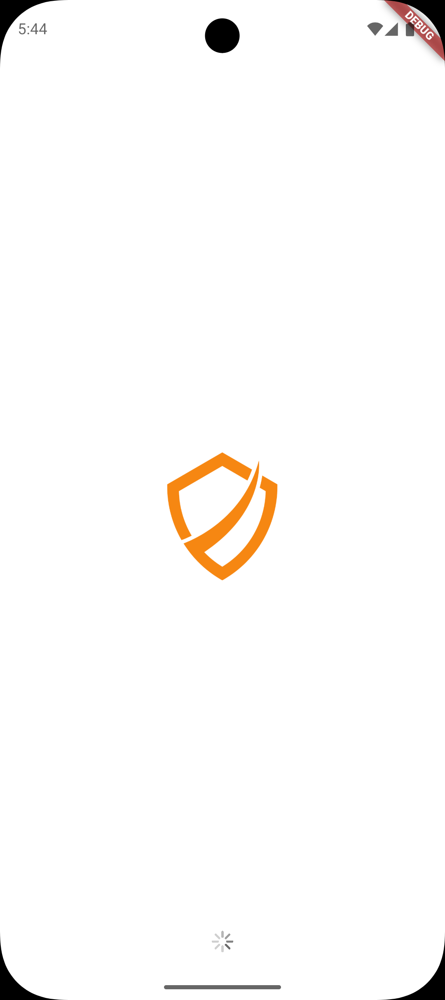
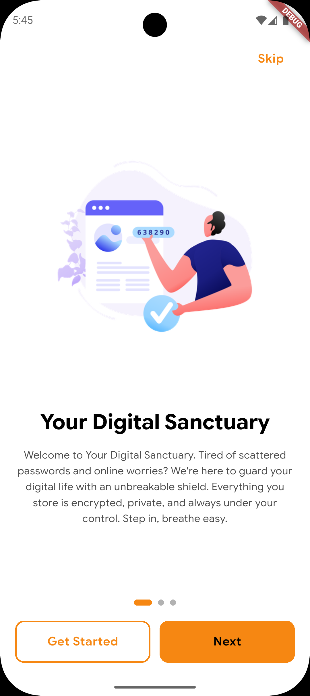
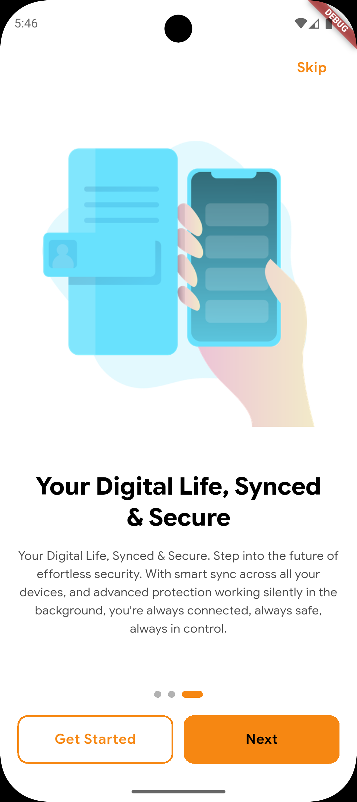
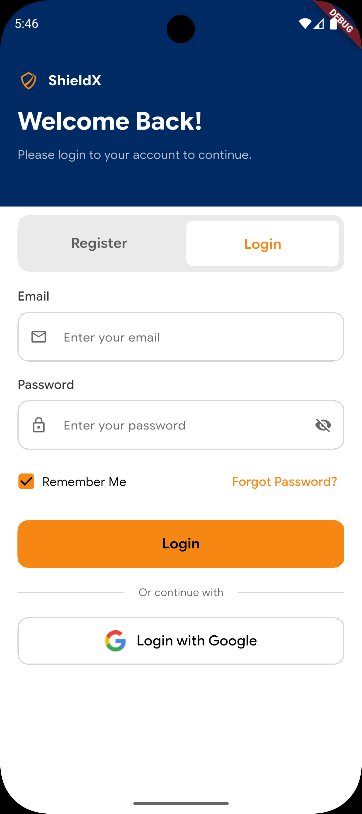
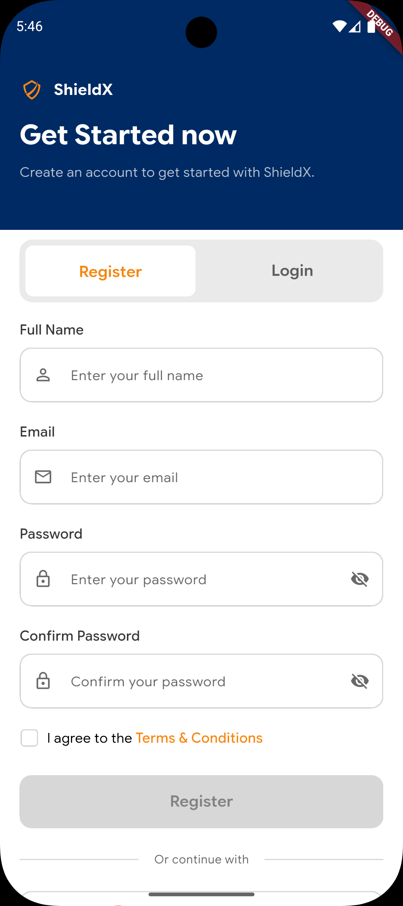

# ShieldX

A secure password manager Flutter application that stores your passwords with military-grade encryption. ShieldX provides a modern, intuitive interface for managing your sensitive credentials with state-of-the-art security features.

## Screenshots

<table>
  <tr>
    <td></td>
    <td></td>
    <td></td>
  </tr>
  <tr>
    <td align="center"><b>Splash Screen</b></td>
    <td align="center"><b>Welcome Screen</b></td>
    <td align="center"><b>Onboarding</b></td>
  </tr>
  <tr>
    <td></td>
    <td></td>
    <td></td>
  </tr>
  <tr>
    <td align="center"><b>Auth Toggle</b></td>
    <td align="center"><b>Registration</b></td>
    <td align="center"><b>Login</b></td>
  </tr>
</table>

## Features Implemented

### Authentication System
- **User Registration** with email and password
- **User Login** with credentials validation
- **Google OAuth Integration** with automatic account creation
  - Sign in with Google on both login and registration
  - Automatic profile creation from Google account data
  - Deep linking for seamless OAuth callback
- **Auto-login** after successful registration
- **Remember Me** functionality with local session storage
- **Logout** with session cleanup
- **Session Persistence** using SharedPreferences
- **Authentication State Management** using BLoC/Cubit pattern

### Modern UI/UX
- **Material 3 Design** with custom color scheme
- **Smooth Page Transitions** using SharedAxisTransition
- **Responsive Layout** adapting to different screen sizes
- **Custom Font Typography** (Google Sans Flex & Inter)
- **Dark status bar** on auth pages
- **Animated Containers** for smooth UI transitions
- **Toast Notifications** for user feedback

### Onboarding Experience
- **Welcome/Onboarding Pages** with 3 introduction slides
- **Skip Functionality** to bypass onboarding
- **Page Indicators** showing current slide
- **Persistent State** - onboarding shown only once

### Architecture & Code Quality
- **Feature-First Architecture** with clear separation of concerns
- **BLoC Pattern** for state management
- **Service Layer** for business logic separation
- **Repository Pattern** for data access
- **Modular Widgets** for code reusability
- **Clean Code** with proper naming conventions

### Technical Features
- **Supabase Integration** for backend authentication
- **Row Level Security (RLS)** policies for database
- **Local Storage** with SharedPreferences
- **Encrypted Database** support with sqflite_sqlcipher
- **Environment Variables** management with flutter_dotenv
- **Network Caching** with cached_network_image
- **SVG Support** for scalable graphics
- **Form Validation** on registration and login
- **Password Visibility Toggle** on password fields
- **Error Handling** with user-friendly messages

### Navigation & Routing
- **Declarative Routing** using go_router
- **Query Parameters** support for route configuration
- **Smart Splash Screen** with conditional navigation:
  - First launch → Welcome/Onboarding
  - Authenticated → Home Page
  - Unauthenticated → Auth Page
- **Protected Routes** based on authentication state

## Tech Stack

### Core Framework
- **Flutter SDK**: ^3.10.4
- **Dart**: Latest

### State Management
- **flutter_bloc**: ^9.1.1 - BLoC/Cubit pattern
- **equatable**: ^2.0.8 - Value equality

### Backend & Database
- **supabase_flutter**: ^2.12.0 - Authentication & Backend
- **sqflite_sqlcipher**: ^3.4.0 - Encrypted local database
- **shared_preferences**: ^2.5.4 - Local key-value storage

### Navigation & Routing
- **go_router**: ^17.0.1 - Declarative routing

### UI & Animations
- **animations**: ^2.1.1 - Page transitions
- **cached_network_image**: ^3.4.1 - Image caching
- **flutter_svg**: ^2.2.3 - SVG rendering

### Networking & Utilities
- **flutter_dotenv**: ^6.0.0 - Environment variables
- **encrypt**: ^5.0.3 - Encryption utilities
- **toastification**: ^3.0.3 - Toast notifications

### UI Components
- **cupertino_icons**: ^1.0.8 - iOS-style icons

## Project Structure

```
lib/
├── main.dart                 # App entry point
├── app/
    ├── app.dart             # Main app widget with BLoC providers
    ├── core/
    │   ├── config/
    │   │   └── _router.dart # Route configuration
    │   └── themes/
    │       ├── _app_theme.dart   # Material theme
    │       └── _app_colors.dart  # Color palette
    ├── data/
    │   └── services/
    │       ├── _supabase.dart            # Supabase client
    │       └── _auth_storage_service.dart # Local session storage
    ├── features/
    │   ├── splash/
    │   │   └── pages/
    │   │       └── _splash_page.dart     # Splash screen
    │   ├── welcome/
    │   │   ├── pages/
    │   │   │   └── _welcome_page.dart    # Onboarding screens
    │   │   ├── widgets/                  # Welcome page components
    │   │   └── models/
    │   │       └── _welcome_model.dart   # Onboarding data
    │   ├── auth/
    │   │   ├── pages/
    │   │   │   └── _auth_page.dart       # Combined auth page
    │   │   ├── widgets/
    │   │   │   ├── _auth_header.dart     # Auth page header
    │   │   │   ├── _auth_toggle.dart     # Register/Login toggle
    │   │   │   ├── _auth_text_field.dart # Custom text input
    │   │   │   ├── _login_form.dart      # Login form
    │   │   │   └── _registration_form.dart # Registration form
    │   │   ├── services/
    │   │   │   ├── _login_service.dart        # Login API calls
    │   │   │   ├── _registration_service.dart # Registration API
    │   │   │   └── _google_auth_service.dart  # Google OAuth
    │   │   └── cubit/
    │   │       ├── _auth_states.dart     # Auth state definitions
    │   │       ├── _login_cubit.dart     # Login state management
    │   │       └── _registration_cubit.dart # Registration state
    │   └── home/
    │       └── pages/
    │           └── _home_page.dart       # Post-login home page
    └── shared/                           # Shared widgets & utilities

supabase/
└── migrations/
    └── 001_create_profiles.sql # Database schema

assets/
├── images/        # Image assets
├── logo/          # App logo
└── fonts/         # Custom fonts (Inter, Google Sans Flex)
```

## Database Schema

### Profiles Table
```sql
CREATE TABLE profiles (
    id UUID PRIMARY KEY,           -- References auth.users
    full_name TEXT NOT NULL,
    email TEXT NOT NULL UNIQUE,
    avatar_url TEXT,
    created_at TIMESTAMPTZ,
    updated_at TIMESTAMPTZ
);
```

**Row Level Security Policies:**
- Users can view their own profile
- Users can update their own profile
- Users can insert their own profile on registration

## State Management Flow

### Authentication Flow
1. **Splash Screen** checks:
   - Onboarding status
   - Local session in SharedPreferences
   - Supabase active session
   - Routes accordingly

2. **Registration**:
   - User submits form → RegistrationCubit
   - Service calls Supabase auth.signUp()
   - Creates profile in database
   - Stores session locally (auto-login)
   - Navigates to Home

3. **Login**:
   - User submits form → LoginCubit
   - Service calls Supabase auth.signInWithPassword()
   - Stores session if "Remember Me" enabled
   - Navigates to Home

4. **Google OAuth**:
   - User clicks "Login/Register with Google"
   - Opens external browser with Google sign-in
   - User authenticates with Google account
   - Browser redirects to deep link URL
   - Android opens app automatically via intent filter
   - Auth state listener detects new session
   - Creates profile if first-time user
   - Stores session locally
   - Navigates to Home

5. **Logout**:
   - Clears Supabase session
   - Clears local SharedPreferences
   - Navigates to Auth page

### Error Handling
- **AuthException** - Displays Supabase error messages
- **Generic Exceptions** - Shows clean error text in toasts
- **Form Validation** - Client-side validation before API calls

## Design System

### Color Palette
- **Primary**: Custom blue shade
- **Secondary**: Accent color
- **Surface**: Background colors
- **Error**: Red for error states

### Typography
- **Primary Font**: Google Sans Flex (headings, buttons)
- **Secondary Font**: Inter (body text)
- **Weights**: Regular (400), Medium (500), SemiBold (600), Bold (700)

### Components
- **Custom Text Fields** with icons and password toggle
- **Checkbox** with transparent background when unchecked
- **Elevated Buttons** with loading states
- **Toast Notifications** for success/error feedback

## Getting Started

### Prerequisites
- Flutter SDK (^3.10.4)
- Dart SDK
- Supabase account and project

### Installation

1. **Clone the repository**
   ```bash
   git clone <repository-url>
   cd shieldx
   ```

2. **Install dependencies**
   ```bash
   flutter pub get
   ```

3. **Setup Supabase**
   - Create a Supabase project
   - Run the migration in `supabase/migrations/001_create_profiles.sql`
   - Get your Supabase URL and anon key

4. **Configure Google OAuth** (for Google Sign-In)
   - Go to [Google Cloud Console](https://console.cloud.google.com/)
   - Create OAuth 2.0 credentials
   - Add authorized redirect URI: `https://<your-project-ref>.supabase.co/auth/v1/callback`
   - In Supabase Dashboard → Authentication → Providers:
     - Enable Google provider
     - Add your Google Client ID and Client Secret
   - In Supabase Dashboard → Authentication → URL Configuration:
     - Add redirect URL: `io.supabase.shieldx://login-callback`

5. **Configure environment variables**
   Create a `.env` file in the root directory:
   ```env
   SUPABASE_URL=your_supabase_url
   SUPABASE_ANON_KEY=your_supabase_anon_key
   ```

6. **Run the app**
   ```bash
   flutter run
   ```

## Build & Deploy

### Android
The AndroidManifest.xml is already configured with deep linking for Google OAuth:
```xml
<intent-filter>
    <action android:name="android.intent.action.VIEW" />
    <category android:name="android.intent.category.DEFAULT" />
    <category android:name="android.intent.category.BROWSABLE" />
    <data
        android:scheme="io.supabase.shieldx"
        android:host="login-callback" />
</intent-filter>
```

Build release APK:
```bash
flutter build apk --release
```

### iOS
```bash
flutter build ios --release
```

### Web
```bash
flutter build web --release
```

## Upcoming Features

- [ ] Password vault with encrypted storage
- [ ] Password generator
- [ ] Biometric authentication (fingerprint/face ID)
- [x] Google OAuth integration
- [ ] Password strength indicator
- [ ] Secure notes
- [ ] Auto-fill integration
- [ ] Multi-device sync
- [ ] Password breach detection
- [ ] Categories & tags for passwords
- [ ] Search & filter functionality
- [ ] Import/export passwords
- [ ] Two-factor authentication (2FA)
- [ ] Dark mode theme
- [ ] Password sharing (secure)

## Contributing

Contributions are welcome! Please feel free to submit a Pull Request.

## License

This project is licensed under the MIT License.

## Author

Developed using Flutter and modern best practices for mobile application development.

---

**Note**: This is a secure password manager application. Always handle user credentials with extreme care and follow security best practices.
